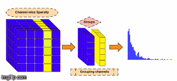
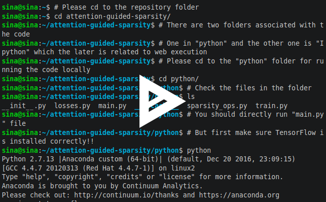
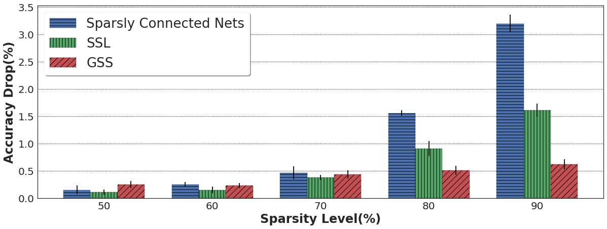

===================================================================================
Attention-Based Guided Structured Sparsity of Deep Neural Networks
===================================================================================
.. image:: https://travis-ci.org/astorfi/attention-guided-sparsity.svg?branch=master
    :target: https://travis-ci.org/astorfi/attention-guided-sparsity
.. image:: https://coveralls.io/repos/github/astorfi/attention-guided-sparsity/badge.svg?branch=master
    :target: https://coveralls.io/github/astorfi/attention-guided-sparsity?branch=master
.. image:: https://img.shields.io/badge/contributions-welcome-brightgreen.svg?style=flat
    :target: https://github.com/astorfi/attention-guided-sparsity/pulls
.. image:: https://badges.frapsoft.com/os/v2/open-source.svg?v=102
    :target: https://github.com/ellerbrock/open-source-badge/
.. image:: http://img.shields.io/badge/license-MIT-brightgreen.svg?style=flat
    :target: https://github.com/astorfi/attention-guided-sparsity/blob/master/LICENSE
.. image:: http://www.repostatus.org/badges/latest/active.svg
   :alt: Project Status: Active – The project has reached a stable, usable state and is being actively developed.
   :target: http://www.repostatus.org/#active
.. image:: https://zenodo.org/badge/120543193.svg
   :target: https://zenodo.org/badge/latestdoi/120543193

This repository contains the code developed by TensorFlow_ for our paper:

| `Attention-Based Guided Structured Sparsity of Deep Neural Networks`_,
| by: `Amirsina Torfi`_ and `Rouzbeh Asghari Shirvani`_

.. _Attention-Based Guided Structured Sparsity of Deep Neural Networks: https://arxiv.org/abs/1901.01939
.. _TensorFlow: https://www.tensorflow.org/
.. _Amirsina Torfi: https://astorfi.github.io/
.. _Rouzbeh Asghari Shirvani: https://www.linkedin.com/in/rozbeh/

#################
Table of Contents
#################
.. contents::
  :local:
  :depth: 3

-----------------
Goal and Outcome
-----------------

Network pruning is aimed at imposing sparsity in a neural network architecture
by increasing the portion of zero-valued weights for reducing its size energy efficiency
consideration and increasing evaluation speed. In most of the conducted
research efforts, the sparsity is enforced for network pruning without any attention
to the internal network characteristics such as unbalanced outputs of the neurons or
more specifically the distribution of the weights and outputs of the neurons. That
may cause severe accuracy drop due to uncontrolled sparsity. In this work, we
propose an attention mechanism that simultaneously controls the sparsity intensity
and supervised network pruning by keeping important information bottlenecks of
the network to be active. On CIFAR-10, *the proposed method outperforms the
best baseline method by 6% and reduced the accuracy drop by 2.6× at the same
level of sparsity.*

-------------------
Scope of the works
-------------------

In this work, we proposed a controller mechanism for network pruning with the goal of (1) model
compression for having few active parameters by enforcing group sparsity, (2) preventing the accuracy
drop by controlling the sparsity of the network using an additional loss function by forcing a
portion of the output neurons to stay alive in each layer of the network, and (3) capability of being
incorporated for any layer type

|im|

-------------
Requirements
-------------

~~~~~~~~~~~
TensorFLow
~~~~~~~~~~~

This code is written in Python and requires **TensorFlow** as the framework. For installation on *Ubuntu*, installing
TensorFlow with *GPU support* can be as follows:

.. code:: shell

    sudo apt-get install python3-pip python3-dev # for Python 3.n
    pip3 install tensorflow-gpu

Please refer to `Official TensorFLow installation guideline`_ for further details considering your specific system architecture.

.. _Official TensorFLow installation guideline: https://openreview.net/pdf?id=S1dGIXVUz

--------------------
Code Implementation
--------------------

~~~~~~~~
dataset
~~~~~~~~
For this repository, the experiments are performed on `MNIST dataset`_ which is available online.
*MNIST* can directly be downloaded using the following script supported by *TensorFLow*:

.. code:: python

    from tensorflow.examples.tutorials.mnist import input_data
    mnist = input_data.read_data_sets(FLAGS.data_dir, fake_data=FLAGS.fake_data)

For which the **FLAGS** are predefined by *argument parser*.

.. _MNIST dataset: http://yann.lecun.com/exdb/mnist/

~~~~~~~~~~~~
Architecture
~~~~~~~~~~~~

In the experiment on MNIST dataset, an architecture similar to **LeNet** has been utilized as a baseline for
investigation of our proposed method with no data augmentation. The baseline architecture has been defined as below:

.. code:: python

    def net(x,training_status):

        with tf.name_scope('reshape'):
            x_image = tf.reshape(x, [-1, 28, 28, 1])

        h_conv1 = nn_conv_layer(x_image, [5, 5, 1, 64], [64], 'conv1', \
                                training_status=training_status, act=tf.nn.relu)

        with tf.name_scope('pool1'):
            h_pool1 = max_pool_2x2(h_conv1)

        h_conv2 = nn_conv_layer(h_pool1, [5, 5, 64, 128], [128], 'conv2',\
                                training_status=training_status, act=tf.nn.relu)

        # Second pooling layer.
        with tf.name_scope('pool2'):
            h_pool2 = max_pool_2x2(h_conv2)

        h_pool2_flat = tf.reshape(h_pool2, [-1, 7 * 7 * 128])

        h_fc1 = nn_layer(h_pool2_flat, 7 * 7 * 128, 512, 'fc1', \
                         training_status=training_status, act=tf.nn.relu)
        dropped_h_fc1 = tf.nn.dropout(h_fc1, keep_prob)

        h_fc2 = nn_layer(dropped_h_fc1, 512, 256, 'fc2', \
                         training_status=training_status, act=tf.nn.relu)
        dropped_h_fc2 = tf.nn.dropout(h_fc2, keep_prob)

        # Do not apply softmax activation yet, see below.
        output = nn_layer(dropped_h_fc2, 256, 10, 'softmax', \
                          training_status=training_status, act=tf.identity)

        return output, keep_prob

----------------------
Training / Evaluation
----------------------

.. <html>
.. <head>
..   <link rel="stylesheet" type="text/css" href="demo/asciinema-player.css" />
.. </head>
.. <body>
..   <asciinema-player src="demo/162175.json" cols="80" rows="24"></asciinema-player>
..   ...
..   
.. </body>
.. </html>

~~~~~~~~
Demo
~~~~~~~~
|speakerrecognition|

~~~~~~~~~~~~
Description
~~~~~~~~~~~~

At first, clone the repository. Then, cd to the dedicated directory:

.. code:: shell

    cd python

Then, execute the ``main.py``:

.. code:: shell

    python main.py --max_steps=100000

Using the above script, the code does the following:

  * Automatically download the dataset
  * Starts training
  * Does the evaluation while training is running.
  * Continue training up to 100000 steps.

**NOTE:** *If you are using a virtual environment which contains TensorFLow, make sure to activate it before running the model.*

--------
Results
--------

The below figure depicts a comparison at different levels of sparsity. As it can be observed from the figure, our
method demonstrates its superiority in higher levels of sparsity. We named our proposed method as **Guided** **Structured**
**Sparsity** (**GSS**).

|imcomp|
